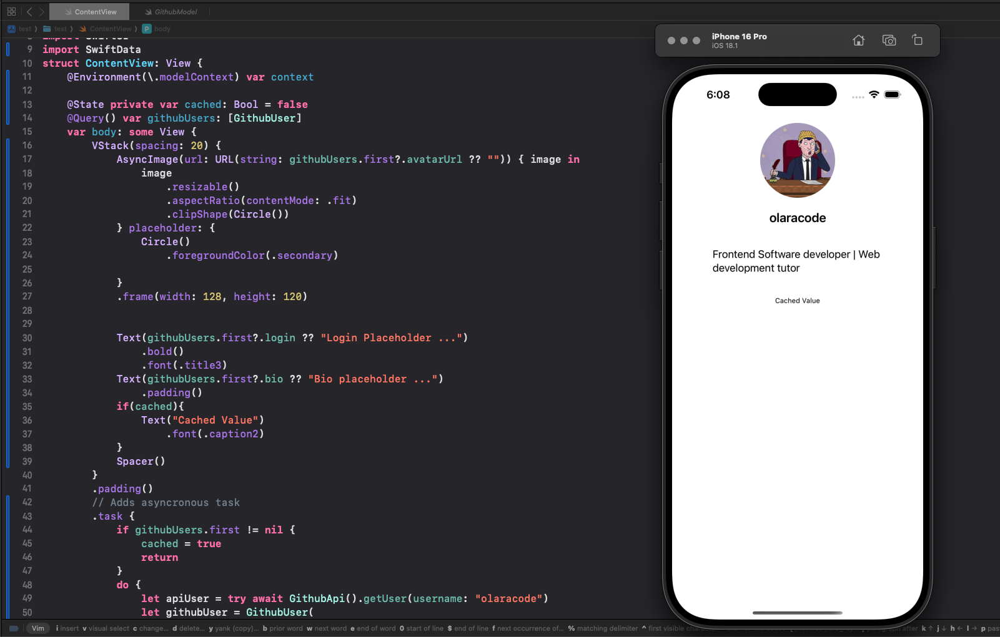

# Github Profile Demo

This project demonstrates how to consume a REST API in SwiftUI by fetching and displaying GitHub user profiles. It uses `SwiftData` for local data storage and `AsyncImage` for loading images asynchronously.

**Index**

- [Defining the API Client](#1-defining-the-api-client)
- [Modeling the data](#2-modeling-the-data)
- [Fetching and displaying the UI](#3-fetching-and-displaying-data-in-swiftui)
- [Error handling](#4-handling-errors)



---

## API Consumption in Swift

### 1. **Defining the API Client**

The `GithubApi` class handles API requests. It constructs the URL, fetches data, and decodes the JSON response into a Swift model.

```swift
// filepath: [GithubApi.swift](http://_vscodecontentref_/1)
class GithubApi {
    let baseUrl = "https://api.github.com/"

    func getUrl(endpoint: String) throws -> URL {
        guard let url = URL(string: endpoint) else {
            throw GithubError.invalidURL
        }
        return url
    }

    func getUser(username: String) async throws -> GithubProfileResponse {
        let endpoint = baseUrl + "users/" + username
        let url = try getUrl(endpoint: endpoint)

        let (data, response) = try await URLSession.shared.data(from: url)

        guard let response = response as? HTTPURLResponse, response.statusCode == 200 else {
            throw GithubError.invalidResponse
        }

        do {
            let decoder = JSONDecoder()
            decoder.keyDecodingStrategy = .convertFromSnakeCase
            return try decoder.decode(GithubProfileResponse.self, from: data)
        } catch {
            throw GithubError.invalidData
        }
    }
}
```

### 2. Modeling the Data

The GithubUser class is used to store user data locally, while GithubProfileResponse is used to decode the API response.

```swift
// filepath: [GithubModel.swift](http://_vscodecontentref_/2)
@Model
class GithubUser {
    var login: String
    var avatarUrl: String
    var bio: String

    init(login: String, avatarUrl: String, bio: String) {
        self.login = login
        self.avatarUrl = avatarUrl
        self.bio = bio
    }
}

struct GithubProfileResponse: Codable {
    let login: String
    let avatarUrl: String
    let bio: String
}
```

### 3. Fetching and Displaying Data in SwiftUI

The ProfileView fetches user data asynchronously and displays it using SwiftUI components.

```swift
struct ProfileView: View {
    @Environment(\.modelContext) var context
    @State private var cached: Bool = false
    @Query() var githubUsers: [GithubUser]

    var body: some View {
        VStack(spacing: 20) {
            AsyncImage(url: URL(string: githubUsers.first?.avatarUrl ?? "")) { image in
                image
                    .resizable()
                    .aspectRatio(contentMode: .fit)
                    .clipShape(Circle())
            } placeholder: {
                Circle()
                    .foregroundColor(.secondary)
            }
            .frame(width: 128, height: 120)

            Text(githubUsers.first?.login ?? "Login Placeholder ...")
                .bold()
                .font(.title3)
            Text(githubUsers.first?.bio ?? "Bio placeholder ...")
                .padding()

            if cached {
                Text("Cached Value")
                    .font(.caption2)
            }
            Spacer()
        }
        .padding()
        .task {
            if githubUsers.first != nil {
                cached = true
                return
            }
            do {
                let apiUser = try await GithubApi().getUser(username: "olaracode")
                let githubUser = GithubUser(
                    login: apiUser.login,
                    avatarUrl: apiUser.avatarUrl,
                    bio: apiUser.bio
                )
                context.insert(githubUser)
            } catch {
                print("Error fetching user: \(error)")
            }
        }
    }
}
```

### 4. Handling Errors

The project defines custom error types to handle various API-related issues

```swift
enum GithubError: Error {
    case invalidURL
    case invalidResponse
    case invalidData
}
```
