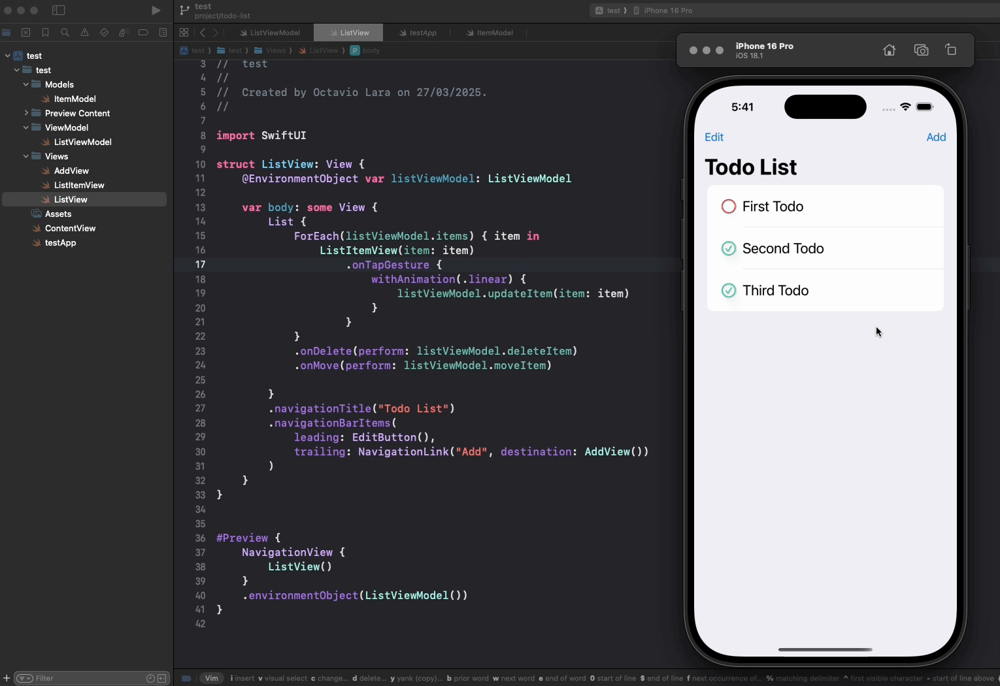
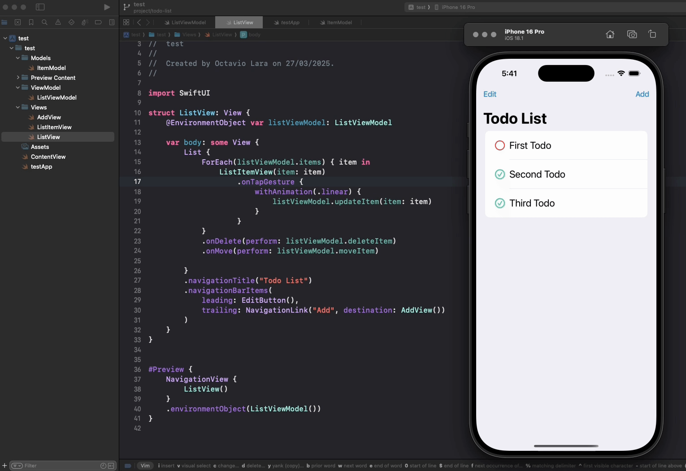
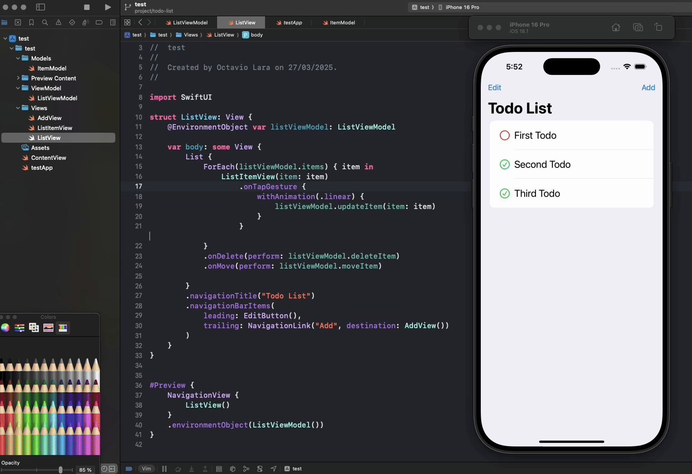

# Todo List

A Simple todo list with two Views, list + creation
**Index**

- [MVVM](#model-view-viewmodel)
- [Global State](#global-state-management)
- [Alerts](#alerts)

## Functionalities

### Add



### Remove



### Toggle



### Reorder


## Model View ViewModel

For this project the MVVM architecture was used to split the code

- View: Everything related to the visuals of the application
- Model: Everything related to the Data Structure used
- ModelView: Everything related to interactions between Modal and view

## Global state management

Managing Global Stage requires a couple of steps in order to comply with MVVM

1. [Model](#model)
2. [ViewModel](#viewmodel)
3. [Declaration and injection](#declaration--injection)
4. [View](#view)

### Model

The first step to handle the global state is to create the Model, our model will be a `struct` that _shapes_ our todo items

```swift
import Foundation
// Immutable Struct
// Identifiable is required for the Iteration ForEach
struct ItemModel: Identifiable {
    let id: String
    let title: String
    let isCompleted: Bool

    // Initialization override
    init(title: String, isCompleted: Bool, id: String = UUID().uuidString){
        self.id = id
        self.title = title
        self.isCompleted = isCompleted
    }

    // returns a newly created ItemModel
    // with the inverted isCompleted
    func updateCompletion() -> ItemModel {
        return ItemModel(
            title: self.title,
            isCompleted: !self.isCompleted,
            id: self.id
        )
    }
}
```

### ViewModel

This Model is then managed by the ViewModel:

```swift
import Foundation

class ListViewModel: ObservableObject {
    @Published var items: [ItemModel] = [];

    init(){
        getItems()
    }

    func getItems(){
        let newItems =  [
            ItemModel(title: "First Todo", isCompleted: false),
            ItemModel(title: "Second Todo", isCompleted: true),
            ItemModel(title: "Third Todo", isCompleted: true)
        ]
        items.append(contentsOf: newItems)

    }

    func deleteItem(indexSet: IndexSet) {
        items.remove(atOffsets: indexSet)
    }

    func moveItem(from: IndexSet, to: Int){
        items.move(fromOffsets: from, toOffset: to)
    }

    func addItem(title: String) {
        let newItem = ItemModel(title: title, isCompleted: false)
        items.append(newItem)
    }

    func updateItem(item: ItemModel){
//        if let index = items.firstIndex { (existingItem) -> Bool in
//            return existingItem.id == item.id
//        } {
//            // run this code
//        }

        if let index = items.firstIndex(where: {$0.id == item.id }){
            items[index] = item.updateCompletion()
        }
    }
}
```

### Declaration & Injection

After creating the ViewModel to manage the Model from the Views, we need to inject the ListViewModel into the application, to do this we need two steps:

1. Creating the StateObject with `@StateObject var fizz`

```swift
@StateObject var listViewModel: ListViewModel = ListViewModel()
```

2. Injecting this StateObject into the application with `.environmentObject` modifier

```swift
 .environmentObject(listViewModel)
```

Example:

```swift
@main
struct testApp: App {
    // Declare the state object
    @StateObject var listViewModel: ListViewModel = ListViewModel()

    var body: some Scene {
        WindowGroup {
            NavigationView {
                ListView()
            }
            // set it as environment to provide to all the elements
            .environmentObject(listViewModel)
        }
    }
}
```

### View

To consume this EnvironmentObject we simply need to call the State on the View we want

```swift
struct ListView: View {
    // Obtain Object from the environment
    @EnvironmentObject var listViewModel: ListViewModel
    // ....
}
```

## Alerts

> Swift Alerts ressemble HTML alerts

To handle alerts for this project we created two states, one to handle the boolean state to show the alert and one to store the error message

```swift
// Set the state variables
@State var alertTitle: String = ""
@State var showAlert: Bool = false

ScrollView {
    // ...Content
} // set the alert modifier
.alert(isPresented: $showAlert, content: getAlert)

// generate the alert element
func getAlert() -> Alert{
    return Alert(title: Text(alertTitle))
}

// usage
func something(){
    // some logic
    alertTitle = "There has been some error"
    showAlert = true
}
```
