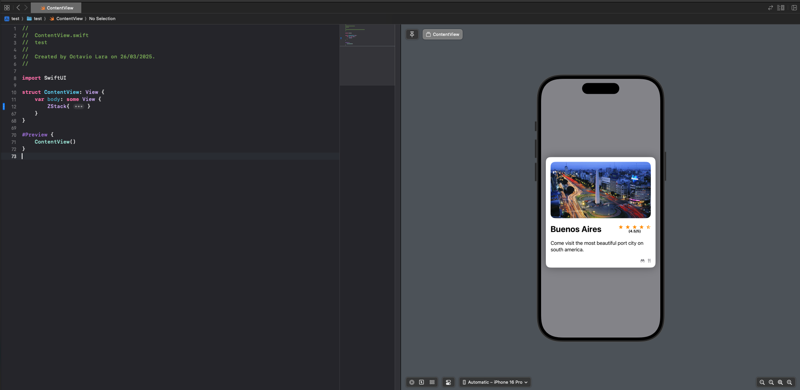

# Swift + SwiftUI

This repository will contain all the projects I develop on my first sprint of Swift UI learning

Index:

- [UI Card](#ui-card)
- [Cards War Game](#cards-war)
- [Todo List](#todo-list)

## UI Card

> [Code](https://github.com/olaracode/swift-ui/tree/ui/intro?tab=readme-ov-file#first-static-ui)

A simple and classic Card ui, with an image, description and action buttons

## Cards War

> [Code](https://github.com/olaracode/swift-ui/tree/project/war-card-game?tab=readme-ov-file#cars-war-game)

A Simple card game to learn the basics of state management on Swift

## Todo List

> [Code](https://github.com/olaracode/swift-ui/tree/project/todo-list)

A simple todo list to learn the basic of global state management + basic of navigations

