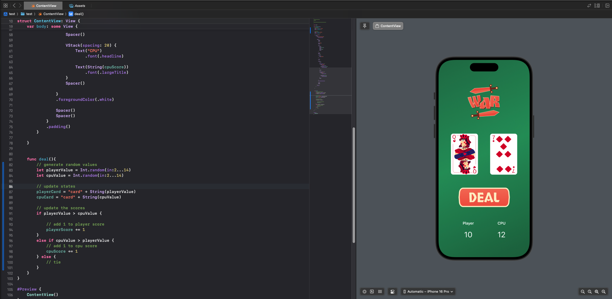

# First Static UI

**Index:**

- [Icon Usage](#icon-usage)
- [Styling](#Styling)
- [Applying same styles to multiple elements](#inheritance)
- [Spacing Elements](#spacing)



## Icon usage

To use icon on IOS you need to download SF Icons and use them along an image, eg:

```swift
Image(systemName: "star.fill")
```

## Styling

### Inheritance

You can apply the same styles to multiple elements by adding the modifiers at the end of the up-most Component/Block

```swift
VStack {
    HStack {
        Image(systemName: "star.fill")
        Image(systemName: "star.fill")
        Image(systemName: "star.fill")
        Image(systemName: "star.fill")
        Image(systemName: "star.leadinghalf.filled")
    }
    Text("(4.5/5)")
}
.foregroundColor(.orange)
.font(.caption)
```

In this example the text color(`.foregoundColor`) and the text size(`.font`) are applied to all the elements inside of the **VStack**

## Spacing

To space items you can use: `Spacer()`, it works by taking all the available space, so if used like this:

```swift
HStack {
    Text("Some Product")
        .font(.title)
        .fontWeight(.bold)
    Spacer()
    Text("5$")
        .font(.caption)
}
```

It's similar as using `space-between` on css, but if you use more than one then the available space gets spread out evenly between the `Spacer()`,

```swift
HStack {
    Spacer()
    Text("Some title")
        .font(.title)
    Spacer()
    Text("Some Subtitle")
        .font(.caption)
    Spacer()
}
```

In this design the spacers split up the space among them and act similar to using `space-around` on css
